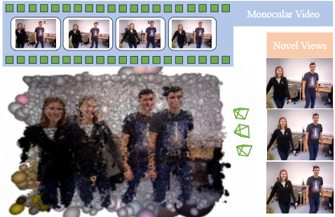
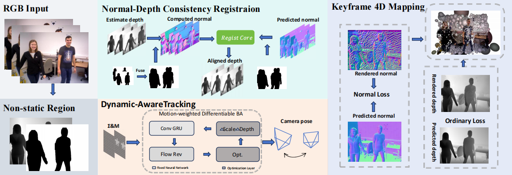

<!-- PROJECT LOGO -->
  <h1 align="center">Anonymous github</h1>


<p align="center">
This is not an officially endorsed Google product.
</p>


<p align="center">
    
</p>

<p align="center">
<strong>Anonymous github
</p>

<p align="center">
    
</p>
<p align="center">
<strong>Anonymous Architecture</strong>.
</p>

<!-- TABLE OF CONTENTS -->
<details open="open" style='padding: 10px; border-radius:5px 30px 30px 5px; border-style: solid; border-width: 1px;'>
  <summary>Table of Contents</summary>
  <ol>
    <li>
      <a href="#installation">Installation</a>
    </li>
    <li>
      <a href="#run">Run</a>
    </li>
    <li>
      <a href="#acknowledgement">Acknowledgement</a>
    </li>
    <li>
      <a href="#citation">Citation</a>
    </li>
    <li>
      <a href="#contact">Contact</a>
    </li>
  </ol>
</details>


## Installation
1. Clone the repo using the `--recursive` flag 
```bash
git clone --recursive https://github.com/Brave2003/Try-in-Splat-SLAM.git
mv Try-in-Splat-SLAM Anonymous   # 可选：保持项目目录名为 Anonymous
cd Anonymous
```
2. Creating a new conda environment (recommended name: `splat`). 
```bash
conda create --name splat python=3.10
conda activate splat
```
3. Install CUDA 11.7 using conda and torch 1.13.1
```bash
pip install torch==1.13.1+cu117 torchvision==0.14.1+cu117 torchaudio==0.13.1 --extra-index-url https://download.pytorch.org/whl/cu117
```
> Now make sure that "which python" points to the correct python
executable. Also test that cuda is available
python -c "import torch; print(torch.cuda.is_available())"

4. Update depth rendering hyperparameter in thirparty library
  > By default, the gaussian rasterizer does not render gaussians that are closer than 0.2 (meters) in front of the camera. In our monocular setting, where the global scale is ambiguous, this can lead to issues during rendering. Therefore, we adjust this threshold to 0.001 instead of 0.2. Change the value at [this](https://github.com/rmurai0610/diff-gaussian-rasterization-w-pose/blob/43e21bff91cd24986ee3dd52fe0bb06952e50ec7/cuda_rasterizer/auxiliary.h#L154) line, i.e. it should read
```bash
if (p_view.z <= 0.001f)// || ((p_proj.x < -1.3 || p_proj.x > 1.3 || p_proj.y < -1.3 || p_proj.y > 1.3)))
```
5. (可选，但强烈推荐) 安装 SAM2 环境与依赖（用于动态掩码 SAM 精修）

> SAM2 代码已作为子模块放在 `thirdparty/sam2` 下。我们建议使用**单独的 conda 环境（默认名为 `sam2env`）**来安装 SAM2，避免与主环境依赖冲突。  
> 下面给出按照官方推荐“最佳配置”的安装方式（参考 `thirdparty/sam2/INSTALL.md`）：
>
> - Linux  
> - Python ≥ 3.10  
> - PyTorch ≥ 2.5.1 + 匹配的 `torchvision`（建议直接用 [pytorch.org](https://pytorch.org/) 提供的一键命令，默认 CUDA 12.1）  
> - CUDA Toolkit 版本与 PyTorch 对应（若用官网默认命令，则通常是 CUDA 12.1）

```bash
conda deactivate
# 创建并激活 sam2env（Python 3.10）
conda create -n sam2env python=3.10
conda activate sam2env

# 从 https://pytorch.org 选择 Linux + Pip + CUDA 12.1 的推荐命令，例如（示例，实际请以官网为准）：
pip install torch==2.5.1 torchvision==0.20.1 torchaudio==2.5.1 --index-url https://download.pytorch.org/whl/cu121

# 在 sam2 子模块目录下按官方方式安装 SAM2（含 notebooks 依赖）
cd thirdparty/sam2
pip install -e ".[notebooks]"

# 若只想安装 CPU 版本或跳过 CUDA 后处理扩展，可使用：
# SAM2_BUILD_CUDA=0 pip install -e ".[notebooks]"

# 安装完成后返回主工程目录
cd ../../
```

`utils/sam2_bridge.py` 默认会按如下规则寻找 SAM2 环境：

- 优先使用环境变量：
  - `SAM2_PYTHON`：显式指定用于运行 `run_sam2_once.py` 的 Python 解释器；
  - `SAM2_ENV_PREFIX`：指定 SAM2 conda 环境前缀路径（例如 `/opt/miniconda3/envs/sam2env`）；
  - `SAM2_ENV_NAME`：仅指定环境名，默认与 `CONDA_ROOT` 组合；
  - `CONDA_ROOT`：若未设置，则默认 `~/miniconda3`。
- 若以上均未设置，则回退到：`~/miniconda3/envs/sam2env/bin/python`。

如果你在非默认位置安装了 conda 或 SAM2 环境，只需在运行前设置对应的环境变量，例如：

```bash
export CONDA_ROOT=/data/opt/miniconda3
export SAM2_ENV_NAME=sam2env
# 或直接设置
# export SAM2_PYTHON=/data/opt/miniconda3/envs/sam2env/bin/python
```

6. Install the remaining dependencies.
> 后面加上参数 --no-build-isolation ， 避免显示没有torch报错
> simple-knn 如果编译不过，可以尝试 创建 
> ``` bash
> thirdparty/simple-knn/simple_knn/__init__.py
> ```
> 然后写入 
> ``` bash
> from . import _C
> ```
> 并在  thirdparty/simple-knn/setup.py 添加
> ``` diff
> name="simple_knn",
> packages=["simple_knn"],
> ```
> 仅供参考

```bash
python -m pip install -e thirdparty/lietorch/
python -m pip install -e thirdparty/diff-gaussian-rasterization-w-pose/
python -m pip install -e thirdparty/simple-knn/
python -m pip install -e thirdparty/evaluate_3d_reconstruction_lib/
```

1. Check installation.
```bash
python -c "import torch; import lietorch; import simple_knn; import diff_gaussian_rasterization; print(torch.cuda.is_available())"
```

1. Now install the droid backends and the other requirements
```bash
python -m pip install -e .
pip install "torch-scatter==2.0.9" --no-build-isolation
python -m pip install -r requirements.txt
python -m pip install pytorch-lightning==1.9 --no-deps
pip install lightning-utilities==0.4.2
pip install ultralytics
pip install "git+https://github.com/facebookresearch/pytorch3d.git"  --no-build-isolation
```

1. Download pretrained models (统一放在 `pretrained/` 下，推荐一键脚本).
```bash
# 在项目根目录执行，将下载 droid / depth_anything_v2_vitl / yolo11l-seg / sam2.1_hiera_base_plus / raft-things（光流）
bash scripts/download_pretrained.sh
```
<details>
  <summary>[Directory structure of pretrained (click to expand)]</summary>
  
```bash
  .
  └── pretrained
        ├── .gitkeep
        ├── droid.pth
        ├── depth_anything_v2_vitl.pth
        ├── yolo11l-seg.pt
        ├── sam2.1_hiera_base_plus.pt
        └── raft-things.pth
```
</details>

## Data Download
### 预训练模型（已由上面脚本覆盖）
若需手动下载：depth_anything_v2_vitl、yolo11l-seg、sam2.1_hiera_base_plus、droid、raft-things 均放入 `pretrained/`，参见 `scripts/download_pretrained.sh` 中的 URL。
If it is not in the class segmented by the YOLO model, then optical flow can be cloned below to generate a mask.
```bash
git clone https://github.com/zhengqili/Neural-Scene-Flow-Fields.git
```
Use YOLO and optical flow to generate a segmentation mask, then input it into SAM to obtain the final segmentation.
```bash
git clone https://github.com/facebookresearch/sam2.git
```
### 光流模型
`raft-things.pth` 已由 `scripts/download_pretrained.sh` 下载到 `pretrained/`。若需 GMA 可选：`gma-things.pth` 见 https://github.com/zacjiang/GMA/blob/main/checkpoints/gma-things.pth，放入 `pretrained/` 后可在代码中改为使用 `pretrained/gma-things.pth`。
### TUM-RGBD
```bash
bash scripts/download_tum.sh
```
Please change the `input_folder` path in the scene specific config files to point to where the data is stored.
### preprocessing

使用 [GeoWizard](https://github.com/fuxiao0719/GeoWizard.git) 生成法向量（normal map）。先 clone GeoWizard 并按其 README 配好环境，然后用本仓库脚本在你的数据集目录上跑指定的 GeoWizard 推理脚本，输出会保存在数据集目录下的一个子目录里。

> 生成部分很慢，最好修改脚本改成多线程

```bash
# 1) clone GeoWizard（只需一次）
git clone https://github.com/fuxiao0719/GeoWizard.git

# 2) 批量运行：遍历每个序列的 rgb/，输出写到同级的 normal/
# 例如：BONN/sequence1/rgb -> BONN/sequence1/normal
python scripts/run_geowizard.py \
  --geowizard_repo /path/to/GeoWizard \
  --entry run_infer.py \
  --dataset_root /path/to/BONN \
  --input_subdir rgb \
  --output_subdir normal \
  --conda_env geowizard \
  --cuda_visible_devices 0 \
  --require_outputs \
  -- --ensemble_size 10 --denoise_steps 50 --seed 0 --domain indoor

# （可选）先 dry-run 看看会跑哪些序列/命令
python scripts/run_geowizard.py \
  --geowizard_repo /path/to/GeoWizard \
  --entry run_infer.py \
  --dataset_root /path/to/BONN \
  --input_subdir rgb \
  --output_subdir normal \
  --dry_run \
  --conda_env geowizard \
  --cuda_visible_devices 0 \
  -- --ensemble_size 3 --denoise_steps 10 --seed 0 --domain indoor

```
## Run
For running Anonymous, each scene has a config folder, where the `input_folder`,`output` paths need to be specified. Below, we show some example run commands for one scene from each dataset.

### TUM-RGBD
To run Anonymous on the `freiburg3_sitting_rpy` scene, run the following command. 
```bash
python run.py configs/TUM_RGBD/rgbd_dataset_freiburg3_sitting_rpy.yaml
```
After reconstruction, the trajectory error will be evaluated automatically.


## Run tracking without mapping
Our Anonymous pipeline uses two processes, one for tracking and one for mapping, and it is possible to run tracking only without mapping/rendering. Add `--only_tracking` in each of the above commands.
```bash
python run.py configs/TUM_RGBD/rgbd_dataset_freiburg3_sitting_rpy.yaml --only_tracking
```

## Acknowledgement
Our codebase is partially based on [splat-SLAM](https://github.com/google-research/Splat-SLAM), [GO-SLAM](https://github.com/youmi-zym/GO-SLAM), [DROID-SLAM](https://github.com/princeton-vl/DROID-SLAM) and [MonoGS](https://github.com/muskie82/MonoGS). We thank the authors for making these codebases publicly available. Our work would not have been possible without your great efforts!

## Reproducibility
There may be minor differences between the released codebase and the results reported in the paper. Further, we note that the GPU hardware has an influence, despite running the same seed and conda environment.

## 提交到自己的 GitHub 仓库
若要将本仓库整理后推送到你自己的 GitHub，请参阅 [GITHUB_PUSH.md](GITHUB_PUSH.md)。


